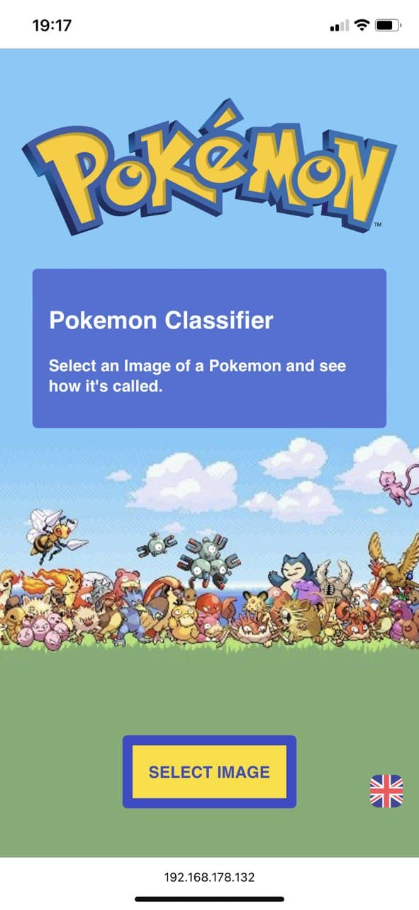
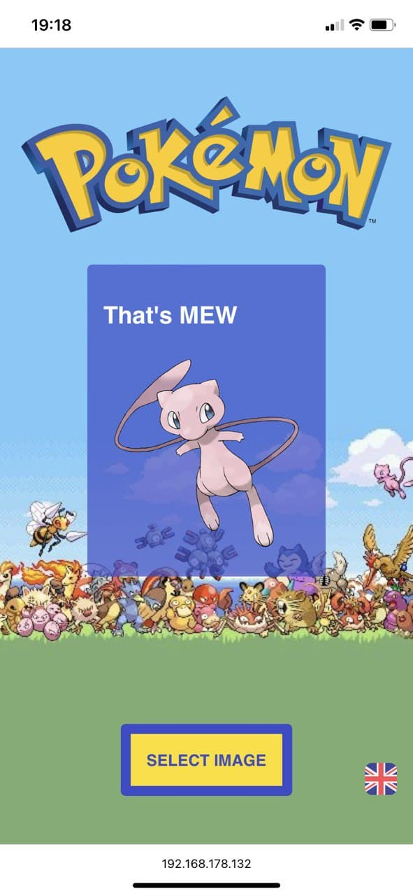
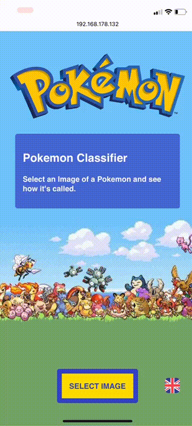

# Pokemon Classifier Web App
This simple web app uses my trained ML model to classify pokemon which was developed [in this project](https://github.com/thomasbohm/pokemon-classifier).

The frontend is built using ***React*** which forwards the classification requests to a ***Flask server*** that performs the ML inference. Finally, a response containing the predicted pokemon name can be sent back and displayed to the user.

||||
|-|-|-|
||||